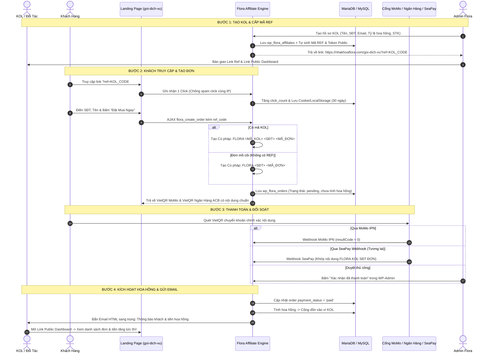

# BẢN KẾ HOẠCH TỔNG THỂ & ĐẶC TẢ HỆ THỐNG AFFILIATE / KOL FLORA DENTAL CLINIC
*(Chuẩn hóa Y Khoa - Bảo mật Đa Tầng - Tích hợp Sẵn Sàng Cổng SeaPay & MoMo)*

---

## 1. TỔNG QUAN HỆ THỐNG & MỤC TIÊU NGHIỆP VỤ

Hệ thống **Flora Affiliate & KOL Management Engine** được thiết kế nhằm mục đích quản lý mạng lưới Đối tác, Bác sĩ liên kết, Reviewer và KOL quảng bá gói dịch vụ nha khoa Flora (trang landing page `https://nhakhoaflora.com/goi-dich-vu`). 

Hệ thống giải quyết trọn vẹn 6 bài toán then chốt:
1. **Quản trị Admin chuyên nghiệp**: Thống kê doanh thu, đơn hàng, tỷ lệ chuyển đổi và quản lý hồ sơ KOL trực quan trong WP-Admin.
2. **Link Public Dashboard dành riêng cho từng KOL**: Cho phép KOL theo dõi kết quả, số lượt click, danh sách khách hàng (được che số bảo mật y tế) và tiền hoa hồng của mình thông qua một đường dẫn bảo mật bằng Secret Hash Token mà **không cần tài khoản đăng nhập WP-Admin**.
3. **Định danh Cú pháp Chuyển khoản (100% Không Thất Lạc Đơn)**: 
   - Đơn có REF: `FLORA <MÃ_KOL> <SĐT> <MÃ_ĐƠN>` (Vd: `FLORA LINH 0912345678 89214`).
   - Đơn mồ côi (Không REF): `FLORA <SĐT> <MÃ_ĐƠN>` (Vd: `FLORA 0912345678 89214`).
   - Tự động sinh VietQR MoMo & VietQR Ngân hàng ACB mang theo mã KOL trực tiếp vào nội dung giao dịch.
4. **Nguyên tắc Tính Hoa Hồng Tuyệt Đối**: **Chỉ ghi nhận hoa hồng & tích lũy tiền khi đơn hàng đã Thanh Toán Thành Công (`payment_status = 'paid'`)**. Đơn chờ (`pending`) chỉ hiển thị ở trạng thái theo dõi, không tính vào số dư khả dụng.
5. **Hệ thống Email Tự Động Đẹp Mắt**: Khi đơn hàng được xác nhận thanh toán (qua MoMo Webhook, xác nhận tay trong Admin, hoặc sau này qua SeaPay), hệ thống tự động gửi email thông báo sang trọng đến hòm thư KOL để chúc mừng và báo chi tiết hoa hồng.
6. **Kiến Trúc Sẵn Sàng Tích Hợp SeaPay (SeaPay-Ready)**: Chuẩn hóa REST API Endpoint và Regex Parser để khi kích hoạt SeaPay, hệ thống tự động đối soát nội dung ngân hàng và hoàn tất đơn trong 1 giây.

---

## 2. KIẾN TRÚC LUỒNG DỮ LIỆU (DATA FLOW DIAGRAM)



---

## 3. THIẾT KẾ CƠ SỞ DỮ LIỆU (DATABASE SCHEMA)

Hệ thống sử dụng cơ chế **Safe Migration (dbDelta)** không làm mất dữ liệu cũ của website, gồm 3 bảng mới và bổ sung cột an toàn cho bảng `wp_flora_orders`.

### 3.1. Bổ sung cột cho bảng `wp_flora_orders`
```sql
ALTER TABLE wp_flora_orders 
ADD COLUMN affiliate_code varchar(50) DEFAULT '' AFTER voucher_code,
ADD COLUMN affiliate_id bigint(20) unsigned DEFAULT 0 AFTER affiliate_code,
ADD COLUMN commission_amount bigint(20) NOT NULL DEFAULT 0 AFTER final_amount,
ADD COLUMN commission_status varchar(30) NOT NULL DEFAULT 'pending' AFTER commission_amount,
ADD COLUMN bank_reference_code varchar(100) DEFAULT '' AFTER momo_trans_id;
```
*Ghi chú:*
- `commission_status`: `pending` (chờ thanh toán), `approved` (đã duyệt hoa hồng khi đơn paid), `paid` (đã chuyển khoản hoa hồng cho KOL), `cancelled` (hủy).

### 3.2. Bảng `wp_flora_affiliates` (Hồ sơ KOL & Đối Tác)
```sql
CREATE TABLE IF NOT EXISTS wp_flora_affiliates (
    id bigint(20) unsigned NOT NULL AUTO_INCREMENT,
    name varchar(255) NOT NULL,
    phone varchar(50) NOT NULL,
    email varchar(255) NOT NULL,
    ref_code varchar(50) NOT NULL,
    secret_token varchar(64) NOT NULL,
    commission_type enum('percent', 'fixed') NOT NULL DEFAULT 'percent',
    commission_rate decimal(10,2) NOT NULL DEFAULT 10.00,
    bank_name varchar(100) DEFAULT '',
    bank_account varchar(100) DEFAULT '',
    bank_owner varchar(255) DEFAULT '',
    status enum('active', 'inactive') NOT NULL DEFAULT 'active',
    total_clicks bigint(20) unsigned NOT NULL DEFAULT 0,
    total_orders bigint(20) unsigned NOT NULL DEFAULT 0,
    paid_orders bigint(20) unsigned NOT NULL DEFAULT 0,
    total_revenue bigint(20) unsigned NOT NULL DEFAULT 0,
    total_commission bigint(20) unsigned NOT NULL DEFAULT 0,
    paid_commission bigint(20) unsigned NOT NULL DEFAULT 0,
    notes text DEFAULT NULL,
    created_at datetime DEFAULT CURRENT_TIMESTAMP,
    updated_at datetime DEFAULT CURRENT_TIMESTAMP ON UPDATE CURRENT_TIMESTAMP,
    PRIMARY KEY (id),
    UNIQUE KEY uq_ref_code (ref_code),
    UNIQUE KEY uq_secret_token (secret_token),
    KEY idx_phone (phone),
    KEY idx_email (email),
    KEY idx_status (status)
) ENGINE=InnoDB DEFAULT CHARSET=utf8mb4 COLLATE=utf8mb4_unicode_ci;
```

### 3.3. Bảng `wp_flora_affiliate_clicks` (Nhật ký Click & Chống Gian Lận)
```sql
CREATE TABLE IF NOT EXISTS wp_flora_affiliate_clicks (
    id bigint(20) unsigned NOT NULL AUTO_INCREMENT,
    affiliate_id bigint(20) unsigned NOT NULL,
    ref_code varchar(50) NOT NULL,
    ip_address varchar(100) NOT NULL,
    user_agent varchar(500) DEFAULT '',
    referer_url text DEFAULT NULL,
    created_at datetime DEFAULT CURRENT_TIMESTAMP,
    PRIMARY KEY (id),
    KEY idx_affiliate_time (affiliate_id, created_at),
    KEY idx_ip_time (ip_address, created_at)
) ENGINE=InnoDB DEFAULT CHARSET=utf8mb4 COLLATE=utf8mb4_unicode_ci;
```

### 3.4. Bảng `wp_flora_affiliate_payouts` (Lịch sử Quyết Toán Hoa Hồng)
```sql
CREATE TABLE IF NOT EXISTS wp_flora_affiliate_payouts (
    id bigint(20) unsigned NOT NULL AUTO_INCREMENT,
    affiliate_id bigint(20) unsigned NOT NULL,
    amount bigint(20) NOT NULL,
    payment_method varchar(50) DEFAULT 'bank_transfer',
    transaction_reference varchar(100) DEFAULT '',
    notes text DEFAULT NULL,
    created_by bigint(20) unsigned NOT NULL,
    created_at datetime DEFAULT CURRENT_TIMESTAMP,
    PRIMARY KEY (id),
    KEY idx_affiliate_id (affiliate_id)
) ENGINE=InnoDB DEFAULT CHARSET=utf8mb4 COLLATE=utf8mb4_unicode_ci;
```

---

## 4. CHI TIẾT CÁC TÍNH NĂNG CHÍNH

### 4.1. Giao Diện WP-Admin Affiliate Dashboard (`inc/affiliate-manager.php`)

Giao diện được xây dựng phong cách **Modern Medical SaaS Dashboard**, đồng bộ thẩm mỹ với giao diện Quản lý Đơn Hàng hiện tại của Flora:
1. **Header & Thao tác nhanh**:
   - Tiêu đề Dashboard, nút **"+ Thêm Mới KOL"** (mở Modal Form tạo nhanh).
   - Nút **"Xuất Toàn Bộ Dữ Liệu Đối Soát (CSV UTF-8 BOM)"**.
2. **Hàng 5 Thẻ KPI Thống Kê**:
   - **Tổng Số KOLs**: Số KOL đang chạy / Tạm dừng.
   - **Lượt Truy Cập Giới Thiệu**: Clicks ghi nhận từ link ref.
   - **Đơn Hàng Ghi Nhận**: Tổng đơn & Số đơn đã thanh toán (`paid`).
   - **Doanh Thu Mang Về**: Doanh thu thực tế đã thu từ KOL.
   - **Hoa Hồng Cần Chi Trả**: Tổng hoa hồng lũy kế - Đã chi trả.
   - **Doanh Thu Đơn Mồ Côi**: Phân tách rõ ràng đơn trực tiếp Flora vs đơn KOL.
3. **Bảng Danh Sách KOL Thông Minh**:
   - **KOL**: Họ tên, SĐT, Email (có icon sao chép nhanh).
   - **Mã REF**: Mã in đậm dạng badge kèm nút **Copy Link Giới Thiệu** (`https://nhakhoaflora.com/goi-dich-vu?ref=XYZ`).
   - **Tỷ lệ Hoa Hồng**: `10%` hoặc `200.000đ/đơn`.
   - **Hiệu quả**: Clicks | Đơn tạo | Đơn thành công | Doanh thu.
   - **Hoa Hồng**: Lũy kế / Đã nhận / Còn lại.
   - **Public Dashboard Link**: Nút mở tab mới hoặc sao chép link bí mật gửi cho KOL.
   - **Hành động**:
     - Nút **"Xem Chi Tiết"**: Mở Modal xem danh sách khách và đơn hàng.
     - Nút **"Chỉnh Sửa"**: Cập nhật thông tin, STK, mức hoa hồng.
     - Nút **"Xuất Đối Soát"**: Tải file Excel riêng của KOL này để gửi thanh toán.
     - Nút **"Quyết Toán"**: Nhập số tiền đã thanh toán hoa hồng cho KOL.

### 4.2. Modal Chi Tiết Từng KOL (KOL Drilldown Drawer)
Khi bấm vào tên KOL hoặc nút "Xem Chi Tiết", một Drawer/Modal sẽ trượt ra mượt mà:
- **Thông tin tài khoản nhận tiền**: Ngân hàng, Số tài khoản, Chủ tài khoản.
- **Thống kê chi tiết**:
  - Số click hợp lệ.
  - Tỷ lệ chuyển đổi Click -> Đơn (CR %).
  - Tổng tiền đơn đã tạo vs Tổng tiền đơn đã thực thu.
- **Bảng Khách Hàng Từ KOL Này**:
  - Mã đơn hàng.
  - Tên khách hàng & Số điện thoại (Admin xem được đầy đủ).
  - Tên gói dịch vụ đã chọn (Vd: Gói Chăm Sóc Nụ Cười Toàn Diện).
  - Giá trị đơn hàng.
  - Trạng thái thanh toán (Badge màu: *Đã thanh toán / Chờ thanh toán*).
  - Tiền hoa hồng của đơn đó.
  - Thời gian tạo & Thời gian thanh toán.
- **Bộ lọc theo ngày** & **Nút Xuất Excel (CSV BOM)** riêng cho danh sách đơn của KOL.

### 4.3. Link Public Dashboard Dành Riêng Cho KOL (`/affiliate-portal/?token=...`)
KOL không cần tài khoản WordPress mà chỉ cần mở link có Secret Token:
- **Bảo mật**: Sử dụng Secret Token 64 ký tự (ví dụ: `?token=9f8a3c...`). Nếu token sai hoặc status `inactive` sẽ báo lỗi truy cập không hợp lệ. Trang có header `X-Robots-Tag: noindex, nofollow` để tránh Google index.
- **Bảo mật dữ liệu Y Khoa (Nghị định 13/2023/NĐ-CP)**:
  - Số điện thoại khách hàng được che: `091****892`.
  - Tên khách hàng hiển thị dạng chuẩn lịch sự: `Anh N*** P***` hoặc `Nguyễn V** A**`.
- **Nội dung hiển thị cho KOL**:
  - Lời chào cá nhân hóa: "Xin chào **[Tên KOL]** - Flora Dental Affiliate Partner".
  - Thẻ tóm tắt: Lượt Click, Số Khách Thành Công, Tổng Hoa Hồng Nhận Được, Số Tiền Đã Thanh Toán, Số Tiền Chờ Quyết Toán.
  - Link giới thiệu cá nhân + Nút Copy 1 chạm + Mã QR Code động để tải về chèn video TikTok, YouTube, Instagram Reels.
  - Danh sách khách hàng và lịch sử đơn hàng phát sinh cập nhật theo thời gian thực.

### 4.4. Cú Pháp Chuyển Khoản & Cơ Chế Định Danh 100%

Để đảm bảo không bao giờ bị sót hoặc nhầm lẫn đơn giữa Flora và KOL:
1. **Trường hợp Khách vào từ Link Ref**:
   - Cú pháp chuyển khoản: `FLORA <MÃ_KOL> <SĐT_KHÁCH> <MÃ_ĐƠN>`
   - Ví dụ: `FLORA LINH 0912345678 89214`
   - Cả mã MoMo QR và VietQR ACB đều mang theo chuỗi này.
2. **Trường hợp Đơn mồ côi (Khách vào tự nhiên không qua link REF)**:
   - Cú pháp giữ nguyên chuẩn gốc của Flora: `FLORA <SĐT_KHÁCH> <MÃ_ĐƠN>`
   - Ví dụ: `FLORA 0912345678 89214`
   - Đơn vẫn được lưu vào `wp_flora_orders` bình thường với `affiliate_id = 0`, `affiliate_code = ''`. Thống kê sẽ gom vào mục "Doanh thu trực tiếp Flora".

### 4.5. Cơ Chế Email Tự Động Bắn Cho KOL Khi Đơn Thành Công
Khi đơn hàng được kích hoạt `paid`:
- Template email chuẩn Brand Luxury Nha Khoa Flora:
  - Tone màu: Xanh Thụy Sĩ (#0033a3, #0493f1), nền trắng ngọc trai, bo góc mềm mại.
  - Banner tiêu đề: "🎉 CHÚC MỪNG! BẠN VỪA CÓ HOA HỒNG MỚI TỪ NHA KHOA FLORA".
  - Thông tin đơn hàng:
    * Khách hàng: `Nguyễn V*** P***`
    * Gói dịch vụ: `Gói Chăm Sóc Nụ Cười Toàn Diện (Care Plus)`
    * Giá trị đơn hàng: `1.990.000 VNĐ`
    * **Hoa hồng ghi nhận cho bạn: +199.000 VNĐ**
    * Thời gian thanh toán: `06/10/2026 14:30:15`
  - Nút bấm lớn (CTA): **"Xem Dashboard Hoa Hồng Của Bạn Ngay"** -> mở trực tiếp link Public Dashboard của KOL.
  - Gửi qua hàm chuẩn `wp_mail` có hỗ trợ HTML UTF-8 và fallback an toàn.

---

## 5. THIẾT KẾ SẴN SÀNG CHO SEAPAY (SEAPAY-READY ARCHITECTURE)

SeaPay là cổng webhook theo dõi biến động số dư ngân hàng Việt Nam (ACB, Vietcombank, Techcombank, MBBank...).

### 5.1. Chuẩn Webhook SeaPay Payload
SeaPay gửi dữ liệu theo định dạng JSON POST:
```json
{
  "id": 1029384,
  "gateway": "ACB",
  "transactionDate": "2026-10-06 14:32:00",
  "accountNumber": "123456789",
  "code": null,
  "content": "FLORA LINH 0912345678 89214 chuyen tien goi kham",
  "transferType": "in",
  "transferAmount": 1990000,
  "accumulated": 50000000,
  "subAccount": null,
  "referenceCode": "FT262791029381"
}
```

### 5.2. Thuật Toán Bóc Tách Đơn Hàng (Smart Regex Parser)
Trong `inc/affiliate-manager.php`, chúng ta tích hợp sẵn hàm bóc tách:
```php
function flora_parse_payment_content($content) {
    // Tìm cụm FLORA...
    // Pattern 1 (Có REF): FLORA (REF_CODE) (0[3|5|7|8|9][0-9]{8}) ([0-9]{5})
    if (preg_match('/FLORA\s+([A-Za-z0-9_-]+)\s+(0[35789][0-9]{8})\s+([0-9]{5})/i', $content, $matches)) {
        return array(
            'has_ref'    => true,
            'ref_code'   => strtoupper($matches[1]),
            'phone'      => $matches[2],
            'order_code' => 'FLORA' . $matches[3]
        );
    }
    // Pattern 2 (Đơn mồ côi): FLORA (0[3|5|7|8|9][0-9]{8}) ([0-9]{5})
    if (preg_match('/FLORA\s+(0[35789][0-9]{8})\s+([0-9]{5})/i', $content, $matches)) {
        return array(
            'has_ref'    => false,
            'ref_code'   => '',
            'phone'      => $matches[1],
            'order_code' => 'FLORA' . $matches[2]
        );
    }
    return false;
}
```

### 5.3. Endpoint Tiếp Nhận SeaPay
- Chuẩn bị sẵn REST API Endpoint:
  `POST /wp-json/flora/v1/seapay-webhook`
- Có trường cấu hình trong Admin: **SeaPay API Secret Key**.
- Khi webhook bắn tới:
  1. Kiểm tra Secret Header (`Authorization: Bearer <SEAPAY_KEY>`).
  2. Bóc tách `order_code` và số tiền `transferAmount`.
  3. Kiểm tra đơn hàng trong DB `wp_flora_orders`.
  4. Nếu số tiền khớp `>= final_amount` và trạng thái `pending`:
     - Cập nhật `payment_status = 'paid'`, `paid_at = NOW()`, `bank_reference_code = referenceCode`.
     - Kích hoạt Hook `do_action('flora_order_paid', $order_id)`.
     - Tự động tính hoa hồng, ghi nhận doanh số KOL và bắn email cho KOL!
  5. Trả về `{"success": true, "message": "Order processed"}` với HTTP 200.

---

## 6. DANH MỤC FILE & CÁC BƯỚC TRIỂN KHAI CHI TIẾT (STEP-BY-STEP)

Để cam kết **tuyệt đối không xung đột, không bug, bảo đảm tính ổn định y tế**, các file được cấu trúc như sau:

| STT | File Mục Tiêu | Mục Đích & Nhiệm Vụ |
|:---:|:---|:---|
| 1 | `flora-theme/inc/affiliate-manager.php` | **[File Mới]** Chứa toàn bộ nghiệp vụ Affiliate: Quản lý DB (migration), Đăng ký Menu Admin, Trang Dashboard Admin, Modal chi tiết AJAX, Xử lý tính hoa hồng, Gửi email tự động, Export CSV UTF-8 BOM, và REST API Webhook SeaPay. |
| 2 | `flora-theme/inc/order-manager.php` | **[Cập Nhật Nhẹ]** Thêm safe migration các cột mới cho `wp_flora_orders`, tích hợp cú pháp chuyển khoản định danh có mã KOL, và phát hook `flora_order_paid` khi admin duyệt đơn hoặc MoMo IPN về. |
| 3 | `flora-theme/page-templates/template-goi-dich-vu.php` | **[Cập Nhật Nhẹ]** Nhận tham số `?ref=...`, ghi nhận click, lưu Cookie 30 ngày & localStorage, gửi `ref_code` vào form `flora_create_order`. |
| 4 | `flora-theme/page-templates/template-affiliate-portal.php` | **[File Mới]** Giao diện Public Dashboard sang trọng dành riêng cho KOL xem bằng Secret Token (Responsive Mobile/Desktop, che số bảo mật y tế). |
| 5 | `flora-theme/functions.php` | **[Cập Nhật]** Đăng ký nạp `affiliate-manager.php` và rewrite rule cho public portal `/affiliate-portal/`. |

---

## 7. KẾ HOẠCH BẢO MẬT & KIỂM THỬ (QA & AUDIT CHECKLIST)

### 7.1. Tiêu Chuẩn Bảo Mật:
- [x] **CSRF / Nonce**: 100% form và action AJAX trong Admin đều có `check_admin_referer` hoặc `check_ajax_referer`.
- [x] **SQL Injection**: 100% câu truy vấn dùng `$wpdb->prepare()` với placeholder đúng kiểu dữ liệu (`%s`, `%d`, `%f`).
- [x] **XSS Sanitization**: 100% input từ người dùng đi qua `sanitize_text_field`, `sanitize_email`, và output hiển thị đi qua `esc_html`, `esc_attr`, `esc_url`.
- [x] **Rate Limit Click Tracker**: Giới hạn ghi nhận click từ cùng 1 địa chỉ IP trong vòng 60 phút để ngăn chặn việc spam F5 làm sai lệch tỷ lệ chuyển đổi.
- [x] **Token Masking**: Secret Token cho public dashboard có độ dài 64 ký tự hex ngẫu nhiên (`bin2hex(random_bytes(32))`), không thể đoán mò.
- [x] **Quy định Y tế & ND 13/2023/NĐ-CP**: Thông tin số điện thoại khách hàng trên trang Public Dashboard luôn bị che 4 số giữa (`091****892`).

### 7.2. Kịch Bản Kiểm Thử (Test Cases):
1. **Tạo KOL mới**: Tạo mã REF `KOL_TEST`, hoa hồng 10%. Kiểm tra sinh link và token.
2. **Khách truy cập link REF**: Vào `https://nhakhoaflora.com/goi-dich-vu?ref=KOL_TEST`. Kiểm tra số click tăng 1, cookie `flora_kol_ref` được lưu.
3. **Tạo đơn hàng từ REF**: Khách đặt gói 1.990.000đ.
   - Kiểm tra nội dung chuyển khoản VietQR: Phải có chữ `FLORA KOL_TEST <SĐT> <MÃ>`.
   - Kiểm tra DB: Đơn ở trạng thái `pending`, hoa hồng tạm tính là 199.000đ nhưng **CHƯA** cộng vào tiền thực nhận của KOL.
4. **Tạo đơn hàng mồ côi (Không REF)**: Vào link gốc không có tham số `ref`.
   - Kiểm tra nội dung chuyển khoản: Phải là `FLORA <SĐT> <MÃ>`.
   - Kiểm tra DB: Đơn ghi nhận `affiliate_id = 0`, Flora lưu trữ độc lập.
5. **Kích hoạt đơn hàng Paid**: Admin bấm "Xác nhận đã thanh toán" trong Admin.
   - Kiểm tra DB: Hoa hồng chính thức được cộng dồn vào ví của KOL.
   - Kiểm tra Email: Tự động bắn 1 email HTML sang trọng đến email của KOL.
6. **Mở Public Dashboard**: Dùng Secret Token của KOL mở link portal.
   - Kiểm tra giao diện hiển thị đúng doanh thu, số đơn, tiền hoa hồng, và danh sách khách bị che số an toàn.
7. **Export Excel**: Bấm xuất file CSV UTF-8 BOM, mở bằng Excel trên Windows không bị lỗi font tiếng Việt.
8. **Mô phỏng Webhook SeaPay**: Gửi thử payload test tới `/wp-json/flora/v1/seapay-webhook` để xác nhận đơn tự động nhảy `paid` và cộng hoa hồng.

---
*(Bản quyền thiết kế giải pháp: Flora Dental Clinic Architecture Team)*
